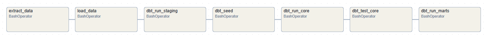

# ⚙️ pdp-analytics-engineering

[](https://github.com/rafa-trindade/pdp-hospedagem)

Este projeto tem como objetivo **implementar, modelar e consumir um Data Warehouse** a partir de dados transacionais do projeto **[pdp-hospedagem](https://github.com/rafa-trindade/pdp-hospedagem)**, utilizando uma arquitetura moderna de dados. Para isso, são empregadas as ferramentas **Apache Airflow**, **DBT (Data Build Tool)** e **Power BI**, integradas em um fluxo de ponta a ponta.

O **Airflow** é responsável pela orquestração dos pipelines de extração, carregamento e transformação dos dados; o **DBT** atua na transformação e modelagem dos dados dentro do Data Warehouse, aplicando boas práticas de engenharia analítica; e o **Power BI** é utilizado na camada de visualização e análise, permitindo a criação de dashboards interativos e indicadores de desempenho.

## 📄 Relatório de Execução do Projeto:

- ✅ Criação da dimensão `dim_data` via Python que será utilizada como **seeds** no DBT.  
- ✅ Ingestão de dados transacionais fictícios no banco de dados **SQL Server** do projeto [**pdp-hospedagem**](https://github.com/rafa-trindade/pdp-hospedagem) utilizando [**datafaker-rafatrindade**](https://github.com/rafa-trindade/datafaker-rafatrindade).  
- ✅ **Conteinerização** do projeto utilizando **Docker**.
- ✅ Implementação da **extração (Extract)** dos dados transacionais via pipeline orquestrada no **Airflow**, com arquivos extraídos salvos na pasta `data/extracted`.  
- ✅ Implementação da **Carga (Load)** dos dados extraídos do SQL Server para a camada **raw** do Data Warehouse (PostgreSQL) via pipeline orquestrada no **Airflow**.  
- ✅ **Transformações (Transform)** e modelagem dos dados no DBT, estruturando as camadas **staging** e **core**.  
- ✅ Implementação de **testes automatizados** via DBT para garantir a **qualidade dos dados** na camada **core**.  
- ✅ Modelagem de tabelas analíticas a partir das **tabelas fato e dimensão** utilizando o DBT na camada **mart**.  
- ✅ **Dataviz:** Exemplo de consumo dos modelos analíticos no **Power BI** com criação de dashboards e relaórios.  


___

## 🧠 Orquestração das DAGs no Airflow:



- `extract_task`: Extrai os dados do **SQL Server**.  
- `load_task`: Carrega os dados brutos na camada **raw** **(PostgreSQL)**.  
- `dbt_staging_task`: Cria as views da camada **staging**, responsáveis por padronizar e preparar os dados brutos.  
- `dbt_seed_task`: Carrega as dimensões estáticas **(seeds)**.  
- `dbt_core_task`: Modela e cria as tabelas **fato** e **dimensão** materializadas na camada **core**.  
- `dbt_test_task`: Executa **testes automatizados** de qualidade de dados na camada **core**.  
- `dbt_marts_task`: Gera as views analíticas da camada **marts**, prontas para consumo no Power BI.

---

## 📊 Camada Marts - Data Warehouse:

A camada **Marts** contém views analíticas derivadas das tabelas da camada **Core**. Cada subpasta organiza os modelos por **categoria de análise** ou **tipo de métrica**, facilitando a consulta e o consumo dos dados.

## 🏦 Financeiro:

## `dw_marts.financeiro_receita_mensal`
**Descrição:**  
Apresenta a receita total mensal proveniente de hospedagens e consumos, consolidando ambas as fontes.

**Tabelas utilizadas:** `fact_hospedagem` `fact_consumo` `dim_data`

| Campo | Tipo | Descrição |
|--------|-------|-----------|
| **data** | DATE | Data obtida via `dim_data` (campo `data`) |
| **origem** | TEXT | `'HOSPEDAGEM'` ou `'CONSUMO'` conforme a tabela fato de origem |
| **cmv** | BOOLEAN | `FALSE` para hospedagem, `TRUE` para consumo |
| **total_receita** | NUMERIC | Soma dos valores (`hospedagem_valor` ou `valor_consumacao`) agrupados por mês/ano |

---

## `dw_marts.financeiro_despesa_mensal`
**Descrição:**  
Consolida as despesas mensais, agrupadas por tipo de despesa (campo `topo`).

**Tabelas utilizadas:** `dim_despesas`

| Campo | Tipo | Descrição |
|--------|-------|-----------|
| **data** | DATE | Data da despesa conforme registrada na dim_despesas |
| **tipo_despesa** | TEXT | Agrupamento pelo campo `tipo` da `dim_despesas` |
| **total_despesa** | NUMERIC | Soma dos valores (`valor`) para o mesmo tipo/mês/ano |

---

## 🏨 Hospedagem:

## `dw_marts.hospedagem_resumo`
**Descrição:**  
Resumo diário das receitas de hospedagens, com observações sobre feriados e finais de semana.

**Tabelas utilizadas:** `fact_hospedagem` `dim_data`

**Campos resultantes:**

| Campo | Tipo | Descrição |
|--------|-------|-----------|
| **data** | DATE | Data da hospedagem |
| **hospedagem** | NUMERIC | Soma de `hospedagem_valor` por data |
| **consumo** | NUMERIC | Soma de `total_consumo` por data |
| **dia_semana** | TEXT | Nome do dia da semana correspondente à data, vindo da `dim_data` |
| **observacao** | TEXT | Nome do feriado, `'FDS'` ou `'-'` validado na `dim_data`|
| **quantidade_hospedes** | INT | Soma de `hospedagem_qtd_pessoas` |
| **total** | NUMERIC | Soma de `hospedagem + consumo` |
| **apt** | NUMERIC(10,2) | Valor médio de hospedagem por hóspede |

---

## 📊 Consumo e Apresentação - Power BI:

## `pdp_dw_powerbi.pbix`

 <!-- -->


---

## 🧩 Modelagem:

## `modelo_olap`


## 💻 Origem dos Dados Transacionais:

## `pdp-hospedagem` [[link]](https://github.com/rafa-trindade/pdp-hospedagem)


---

## ⚡ Inicialização do ambiente com Docker:

```bash
docker-compose build
docker-compose up -d
```

## ⚡ Exemplo de execução manual para teste da DAG de extração:

```bash
docker exec -it airflow airflow tasks test elt_dag extract_data 2025-10-24
```

## ⚡ Exemplo de execução manual para teste da DAG de carga:

```bash
docker exec -it airflow airflow tasks test elt_dag load_data 2025-10-24
```

---

## 📦 Bibliotecas Utilizadas:

**Ambiente:** Python 3.11 + Airflow 2.9.3

| Pacote            | Versão      | Observação |
|-------------------|------------|------------|
| **pandas**        | 2.3.3      | Manipulação e transformação de dados |
| **requests**      | 2.32.3     | Requisições HTTP e integração de APIs |
| **python-dotenv** | 1.0.1      | Carregamento de variáveis de ambiente do arquivo `.env` |
| **dbt-core**      | 1.10.13    | Transformações e modelagem no Data Warehouse |
| **dbt-postgres**  | 1.9.1      | Adaptador DBT para PostgreSQL |
| **SQLAlchemy**    | 2.0.22     | ORM e conexão com bancos de dados |
| **psycopg2-binary** | 2.9.7   | Driver PostgreSQL para Python |
| **pyodbc**        | 5.3.0      | Driver ODBC para conexão com diversos bancos |
| **msodbcsql17** | Microsoft (APT) | Driver oficial ODBC do SQL Server para Linux |

---

## 🗂️ Estrutura do Projeto:

```text
pdp-analytics-engineering/
├── airflow/                 # Orquestração de pipelines ETL/ELT com Airflow
│   ├── dags/                # Definição dos DAGs
│   ├── logs/                # Armazenamento de logs de execução dos DAGs
│   └── plugins/             # Plugins customizados do Airflow
├── config/                  # Arquivos de configuração do projeto
├── data/                    # Dados brutos
├── dbt/                     # Projeto DBT
│   ├── models/              
│   │   ├── staging/         # Modelos staging (limpeza e padronização de dados)
│   │   ├── core/            # Modelos core (dados integrados e limpos)
│   │   └── marts/           # Modelos marts (tabelas para análise e dashboards)
│   ├── seeds/               # Seeds (ex.: dim_date)
│   ├── tests/               # Testes de qualidade do DBT
│   ├── dbt_project.yml      # Configuração do projeto DBT
│   └── profiles.yml         # Configuração de conexão com o banco
├── docs/                    # Documentação do projeto
│   ├── diagrams/            # Diagramas de bancos OLTP e DWH
│   ├── powerbi_screenshots/ # Capturas de tela de dashboards
│   └── data_dictionary.md   # Dicionário de dados
├── reports/                 # Relatórios Power BI exportados
├── scripts/                 # Pipelines ETL e scripts auxiliares (ex.: geração de seeds via Python)
├── .env                     # Variáveis de ambiente do projeto
├── docker-compose.yml       # Configuração para execução de containers Docker
├── Dockerfile               # Definições da imagem Docker do projeto
├── main.py                  # Script para execução local
├── README.md                # Documentação do projeto
└── requirements.txt         # Dependências Python
```

